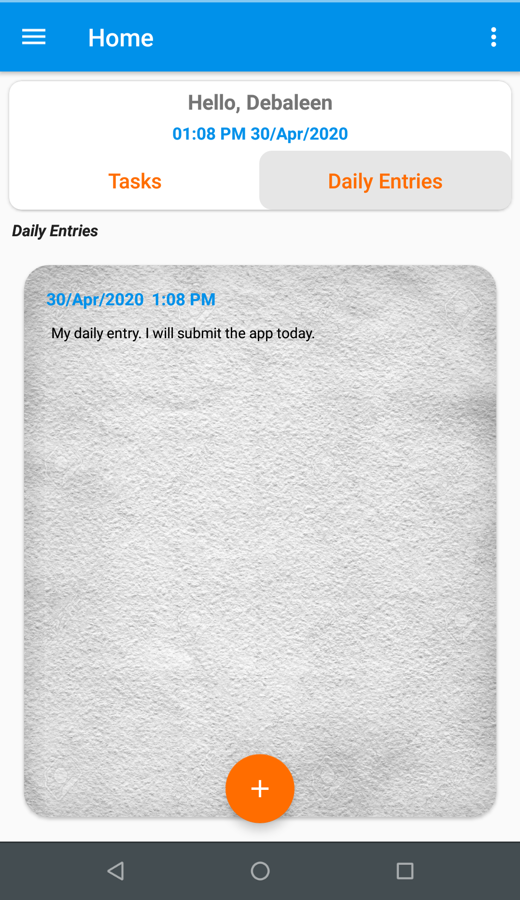
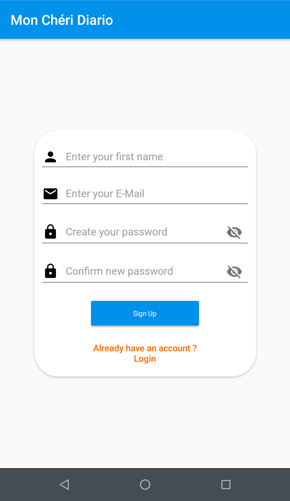

<p align="center">
  
</p>

# Mon Chéri Diario

[](LICENSE)


**Mon Chéri Diario** is a simple diary cum to-do Android application 📱 which uses [Firebase](https://firebase.google.com/) for data storage and authentication. Dedicated to all Android Developers with ❤️. 

<table style="width:100%">
  <tr>
    <th>Home Screen (Daily Entries)</th>
    <th>Home Screen (Tasks)</th>
    <th>Navigation Drawer</th>
    <th>Login Screen</th>
    <th>Registration Screen</th>
  </tr>
  <tr>
    <td></td>
    <td></td>
    <td></td>
    <td></td>
    <td></td>
  </tr>
</table>

## About
- The app is a simple diary cum to-do app where users can maintain a daily diary and also maintain their tasks
- Tasks can be categorized into different categories.
- Users can sign up in the app using their email.
- The app also provides features to reset password if user forgets his/her password.


## Built With 🛠
- [Java](https://docs.oracle.com/javase/8/docs/technotes/guides/language/index.html) - A general-purpose, concurrent, strongly typed, class-based object-oriented language.
- [Firebase](https://firebase.google.com/) - Firebase is Google's mobile platform that helps you quickly develop high-quality apps and grow your business.
- [FirebaseUI for Android](https://firebaseopensource.com/projects/firebase/firebaseui-android/) - FirebaseUI is an open-source library for Android that allows you to quickly connect common UI elements to Firebase APIs.


# Package Structure
    
    com.kingominho.monchridiario    # Root Package
    .
    ├── activity             # Activity files
    ├── adapters             # Adapter classes
    ├── manager              # Utility and Manager classes
    ├── models               # Model classes
    |
    └── ui                   # UI views and Fragments
       └── about           
       └── addTask
       └── changePassword
       └── dailyEntries  
       └── home  
       └── manageCatagory  
       └── share  
       └── toDo  
       └── tools
       └── viewTasks
    

## Credits
Thanks to
- [Coding in Flow](https://codinginflow.com/) - for his awesome tutorials on Android Development.

- [Picasso](https://square.github.io/picasso/) - A powerful image downloading and caching library for Android

- [Picasso Transformations](https://github.com/wasabeef/picasso-transformations) - An Android transformation library providing a variety of image transformations for Picasso.

- [Android Image Cropper](https://github.com/ArthurHub/Android-Image-Cropper) - Powerful (Zoom, Rotation, Multi-Source), customizable (Shape, Limits, Style), optimized (Async, Sampling, Matrix) and simple image cropping library for Android.

## Attributions
- [App Icon](https://www.pngrepo.com/svg/246093/diary) - from PNG Repo

- Paper Texture from [Freepik](https://www.freepik.com/)


## License
```
MIT License

Copyright (c) 2020 Debaleen Das Spandan

Permission is hereby granted, free of charge, to any person obtaining a copy
of this software and associated documentation files (the "Software"), to deal
in the Software without restriction, including without limitation the rights
to use, copy, modify, merge, publish, distribute, sublicense, and/or sell
copies of the Software, and to permit persons to whom the Software is
furnished to do so, subject to the following conditions:

The above copyright notice and this permission notice shall be included in all
copies or substantial portions of the Software.

THE SOFTWARE IS PROVIDED "AS IS", WITHOUT WARRANTY OF ANY KIND, EXPRESS OR
IMPLIED, INCLUDING BUT NOT LIMITED TO THE WARRANTIES OF MERCHANTABILITY,
FITNESS FOR A PARTICULAR PURPOSE AND NONINFRINGEMENT. IN NO EVENT SHALL THE
AUTHORS OR COPYRIGHT HOLDERS BE LIABLE FOR ANY CLAIM, DAMAGES OR OTHER
LIABILITY, WHETHER IN AN ACTION OF CONTRACT, TORT OR OTHERWISE, ARISING FROM,
OUT OF OR IN CONNECTION WITH THE SOFTWARE OR THE USE OR OTHER DEALINGS IN THE
SOFTWARE.
```